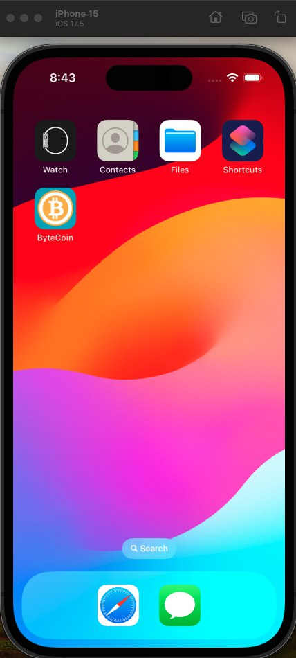
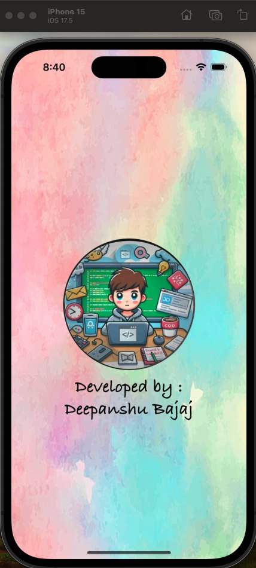
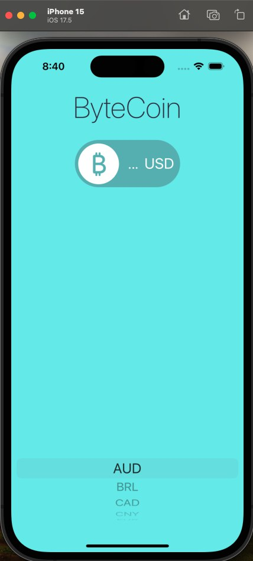
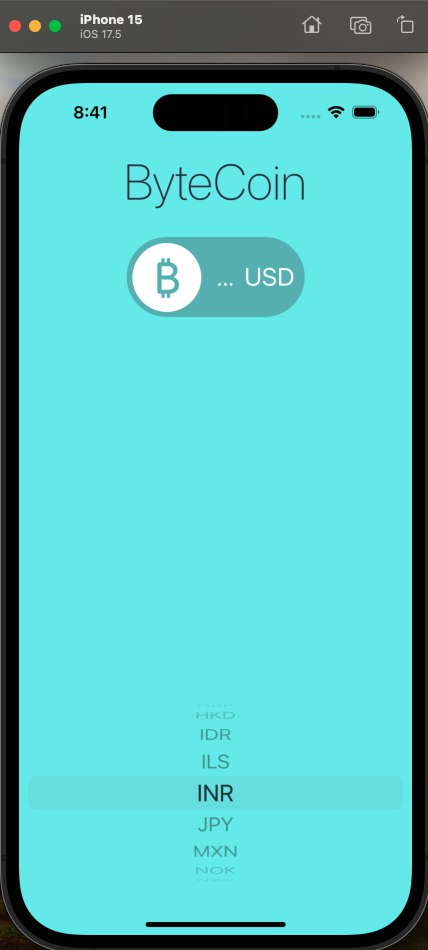
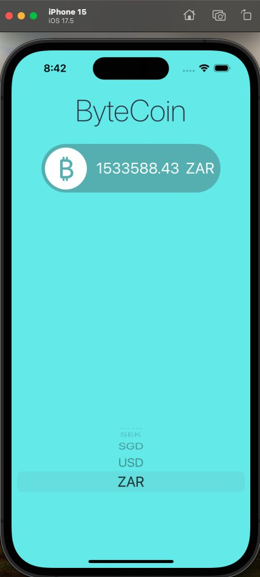
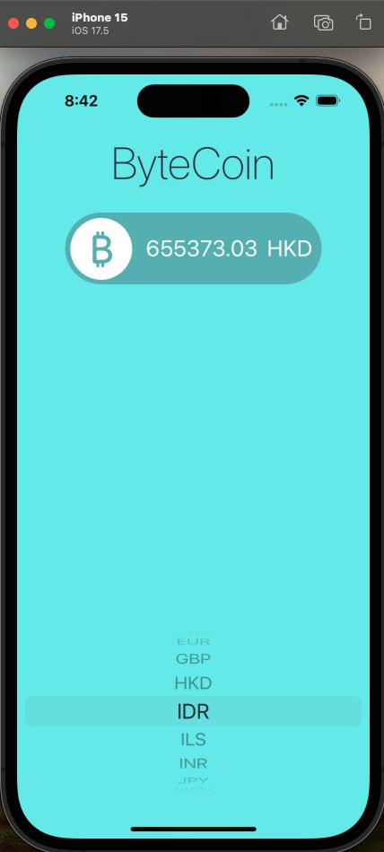
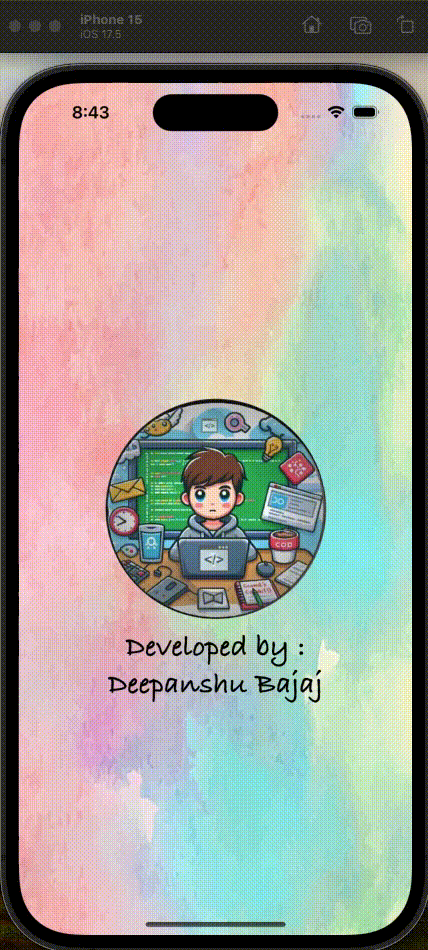

<h1 align="center">ByteCoin - iOS App</h1>

**ByteCoin** is an iOS app that provides real-time exchange rates of Bytecoin (BCN) in various currencies. By using the CoinAPI, the app fetches accurate cryptocurrency data, allowing users to see the current value of Bytecoin (BCN) in their preferred currency. It's a simple and user-friendly app for anyone interested in tracking the value of Bytecoin in multiple currencies.

## Features:

- **Real-Time Exchange Rates**: Get real-time exchange rates of Bytecoin (BCN) in different currencies.
- **Manual Currency Search**: Search for the value of Bytecoin in any currency (e.g., USD, EUR, etc.).
- **Easy-to-Use Interface**: A simple and intuitive design for checking cryptocurrency values.
- **Currency Support**: Supports various popular currencies (USD, EUR, GBP, etc.).

## Installation:

To run this project locally:

1. Clone the repository:
    ```bash
    git clone https://github.com/deepanshubajaj/ByteCoin-iOSApp.git
    ```

2. Open the project in Xcode:
    ```bash
    open ByteCoin.xcodeproj
    ```

3. Build and run the app on a simulator or physical device.

> Make sure you have Xcode installed and configured properly to run the project.

## API Reference:

- **CoinAPI**: The value of Bytecoin is fetched using the [CoinAPI](https://www.coinapi.io/products/market-data-api/pricing). You can explore their API documentation for more details and how to access market data.
  
- **API Key Setup**: To use the CoinAPI, you'll need to register and obtain an API key from [here](https://www.coinapi.io/products/market-data-api/pricing).
  
- **CoinAPI Documentation**: You can refer to the full documentation on using the API to get market data [here](https://docs.coinapi.io/).

- **Project Usage**: Add your own API-Id Value by adding the file envFileByteCoinApp.swift in the project in the following format.
    ```bash
    import Foundation

    struct envFileByteCoinApp {
        static let apiIdValue = "Your_Own_API_Value"
    }
    ```

## App Look:

<p align="center">
  
</p>
<p align="center">
  *App snapshot showing the main interface of the ByteCoin app.*
</p>

## Screenshots:

<p align="center">
  
</p>
<p align="center">
  *Splash screen displayed upon app launch.*
</p>

<p align="center">
  <div style="display: flex; justify-content: center; gap: 10px; flex-wrap: wrap; max-width: 60%;">
    
    
  </div>
</p>

<p align="center">
  <div style="display: flex; justify-content: center; gap: 10px; flex-wrap: wrap; max-width: 60%;">
    
    
  </div>
</p>

<p align="center">
  *Screenshots showing different stages of the app displaying Bytecoin value in different currencies.*
</p>

## App Icon:

<p align="center">
  
</p>
<p align="center">
  *The app icon reflects the clean and modern theme of the ByteCoin app.*
</p>

## Video Demo:

Here’s a short video showcasing the app's functionality:

<p align="center">
  
</p>

[Watch Working Video](ProjectOutputs/WorkingVideo/workingVideo.mov)
